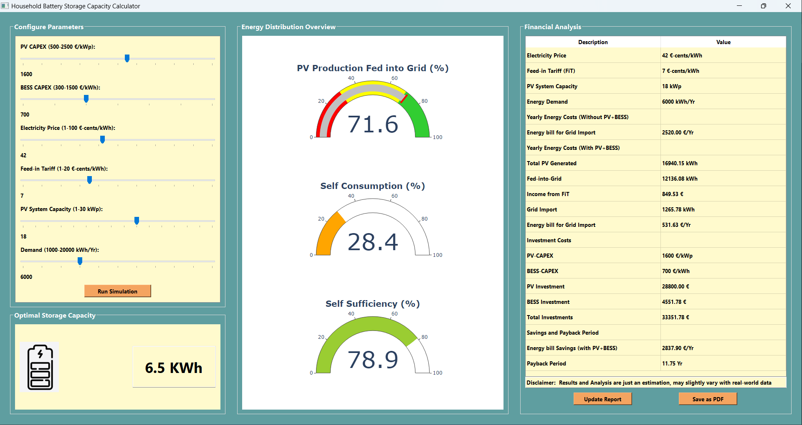
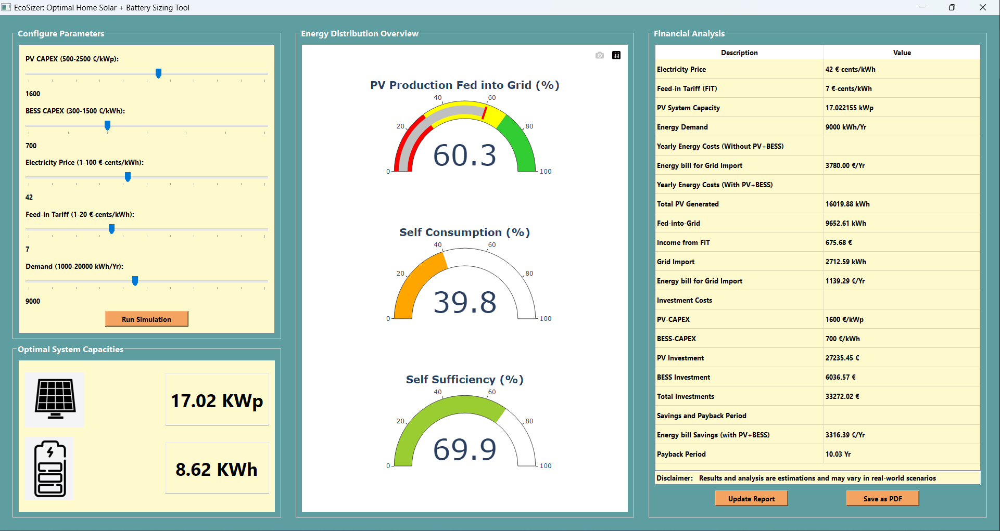

# EcoSizer: Optimal Home Solar + Battery Sizing Tool

## Introduction

Household PV and Battery Storage Systems are becoming increasingly important in the modern energy landscape, providing numerous advantages such as:

- **Self-Consumption:** Maximizes direct use of energy produced by your own PV system.
- **Self-Sufficiency:** Enhances self-sufficiency by reducing dependence on external energy sources.
- **Energy Independence:** Allows households to generate and store their own electricity.
- **Cost Savings:** Reduces reliance on grid electricity during peak hours, saving money.
- **Environmental Impact:** Promotes the use of renewable energy sources and lowers carbon footprint.
- **Grid Support:** Can contribute excess energy back to the grid, supporting overall grid stability.

## Importance of Optimal Sizing

Determining the optimal capacities is crucial for maximizing these benefits. This tool aims to assist users in calculating the optimal PV+BESS and only storage capacity based on various parameters.

  - Maximizing Benefits: Optimal sizing ensures that PV, battery energy storage systems (BESS), and other components operate  efficiently, maximizing benefits such as energy independence and cost savings.

  - Avoiding Wastage: Inadequate sizing can lead to energy wastage and increased operational costs. Optimal sizing helps avoid unnecessary resource use and financial expenditures.

  - Reliable Energy Supply: A carefully sized system guarantees a reliable energy supply. An oversized system can meet demand, while an undersized one may lead to insufficient electricity supply. Achieving optimal benefits requires a balance in system sizing [[11]].

## About the Tool

<p align="justify"> The EcoSizer is a Python application offering two distinct tools tailored to meet specific needs. Firstly, it includes an OEMOF Storage_Investment optimization model designed for homeowners and installers aiming to estimate the optimal battery storage capacity for an existing PV system. Secondly, for those planning a new setup, the tool assists in determining the optimal capacities for both PV and BESS within households. This comprehensive solution simplifies decision-making by providing insights into energy distribution, financial analysis, and the most efficient capacities for solar and battery storage.</p>

<p align="justify"> Whether your goal is to enhance energy independence, reduce costs, or contribute to environmental sustainability, this calculator empowers users to make informed choices. It allows for customization of parameters to suit unique needs and preferences, ensuring a tailored solution for each user.</p>

**Key Features:**


*EcoSizer Storage*

- Determines optimal battery capacity for an existing PV system.



*EcoSizer SunVault*

- Determines optimal capacities for both PV and BESS in new household setups.



**Limitations:**

- Maximum PV capacity considered is up to 30 kWp, catering to typical household scenarios.
- The PV feed-in profile is based on the location from the central part of Germany, impacting the tool's accuracy in regions with      significantly different solar profiles.
- In the PV+BESS model, the maximum PV capacity is dependent on the feed-in tariff (FiT). If FiT is 8 and above, the maximum capacity is 10 kWp; otherwise, it is capped at 30 kWp, following amendments to the EEG considering partial feed-in.
- The tool assumes a system lifetime of 25 years for PV and 10 years for Battery Storage.
- The battery efficiency is set at 95% in the calculations.


## Download Tool

### For Non-Programmers

If you don't have a programming background, no worries! We've prepared a user-friendly version of EcoSizer for you. Simply click the link below to download the tool, which includes an executable file:

[Download EcoSizer](https://www.dropbox.com/scl/fo/gzrwrflunfsfqv6ozslq9/h?rlkey=5bunyx1fv78n6x91gsh20x4h7&dl=0) <!-- Replace # with the actual download link -->

**Note:** When executing the file you may notice a brief appearance of a Command Prompt or Console window. Please be assured that this is a normal part of the process and can be safely ignored. 


## Environment and Dependencies

To set up the environment for running the tool, follow these steps:

1. **Create New Environment:**

    Creating a new environment is a good practice to manage dependencies and isolate your project. THe following link helps you with all the steps in order to create a new environment: https://realpython.com/python-virtual-environments-a-primer/

2. **Install Dependencies:**
   
    ```bash
    pip install oemof.solph = 0.5.2
    pip install PyQt5
    pip install plotly
    ```
    To make the oemof-solph optimization model work, you need to set up a solver. The steps for installing this solver vary depending on the system type you're using. Here's a guide to help you through the installation process on different operating systems. https://oemof-solph.readthedocs.io/en/stable/readme.html#contents or https://youtu.be/eFvoM36_szM?si=3pRmnGV7J129kBKo

3. **Clone the Repository:**
    ```bash
    git clone https://github.com/Jayasurya-Vardhan/Storage_optimization_Tool.git
    ```

4. **Run the Application:**
     ```bash
    PV_BESS_GUI.py
    BESS_GUI.py
    ```

## Contributions

Any kind of contributions to the project are welcome! This can help in enhancing the tool and make it more user-friendly. If you would like to contribute, please follow these guidelines:

- Fork the repository and create a new branch for your feature or bug fix.
- Make your changes and submit a pull request.
- Provide a clear and detailed description of your changes.

Thank you for considering contributing to the EcoSizer!

## Citation

If you find this tool helpful in your work, please consider citing the following:

```
@software{EcoSizer: Optimal Home Solar + Battery Sizing Tool,
  author={Jayasurya Vardhan, Pujari},
  url={https://github.com/Jayasurya-Vardhan/EcoSizer.git},
  year={2024},
  note={Accessed: Date},
  version={1.0},
}

@software{oemof.solph—A model generator for linear and mixed-integer linear optimisation of energy systems,
  author={Uwe Krien, Patrik Schönfeldt, Jann Launer, Simon Hilpert, Cord Kaldemeyer, Guido Pleßmann},
  url={https://oemof-solph.readthedocs.io/en/latest/readme.html},
  year={2020}
}

```


<!-- 
### For Developers and Advanced Users

If you have programming skills and want to explore or contribute to the source code, you can find the project on GitHub. Feel free to check it out, contribute, or raise issues:

[GitHub Repository: EcoSizer](https://github.com/yourusername/yourrepository)

---

**Note:** Ensure you have Python installed to run the source code version. The executable file is included in the user-friendly version for non-programmers. -->