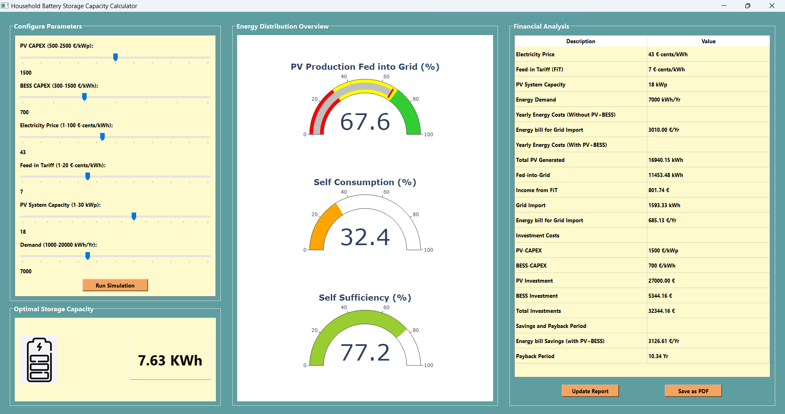

# Household Battery Storage Capacity Calculator

## Introduction

Household Battery Storage is becoming increasingly important in the modern energy landscape, providing numerous advantages such as:

- **Energy Independence:** Allows households to generate and store their own electricity.
- **Cost Savings:** Reduces reliance on grid electricity during peak hours, saving money.
- **Environmental Impact:** Promotes the use of renewable energy sources and lowers carbon footprint.
- **Grid Support:** Can contribute excess energy back to the grid, supporting overall grid stability.

Determining the optimal capacity for battery storage is crucial for maximizing these benefits. This tool aims to assist users in calculating the optimal storage capacity based on various parameters.

## About the Tool

<!-- The Household Battery Storage Capacity Calculator is a Python application designed to help household owners and installers to estimate, analyze the capacity and performance of battery storage systems in households making it easy for decision-making. It provides insights into energy distribution, financial analysis, and optimal storage capacity based on user-defined parameters. -->
The Household Battery Storage Capacity Calculator is a Python application meticulously crafted to assist homeowners and installers in estimating and analyzing the capacity and performance of battery storage systems within households. This tool serves as a valuable asset, simplifying decision-making processes by providing comprehensive insights into energy distribution, financial analysis, and determining the optimal storage capacity. Whether you are planning to enhance energy independence, reduce costs, or contribute to environmental sustainability, this calculator empowers users to make informed choices by customizing parameters to suit their unique needs and preferences.



## Environment and Dependencies

To set up the environment for running the tool, follow these steps:

1. **Clone the Repository:**
    ```bash
    git clone https://github.com/your-username/household-battery-calculator.git
    cd household-battery-calculator
    ```

2. **Install Dependencies:**
    ```bash
    pip install -r requirements.txt
    ```

3. **Run the Application:**
    ```bash
    python main.py
    ```

## Contributions

Contributions to the project are welcome! If you would like to contribute, please follow these guidelines:

- Fork the repository and create a new branch for your feature or bug fix.
- Make your changes and submit a pull request.
- Provide a clear and detailed description of your changes.

Thank you for considering contributing to the Household Battery Storage Capacity Calculator!
